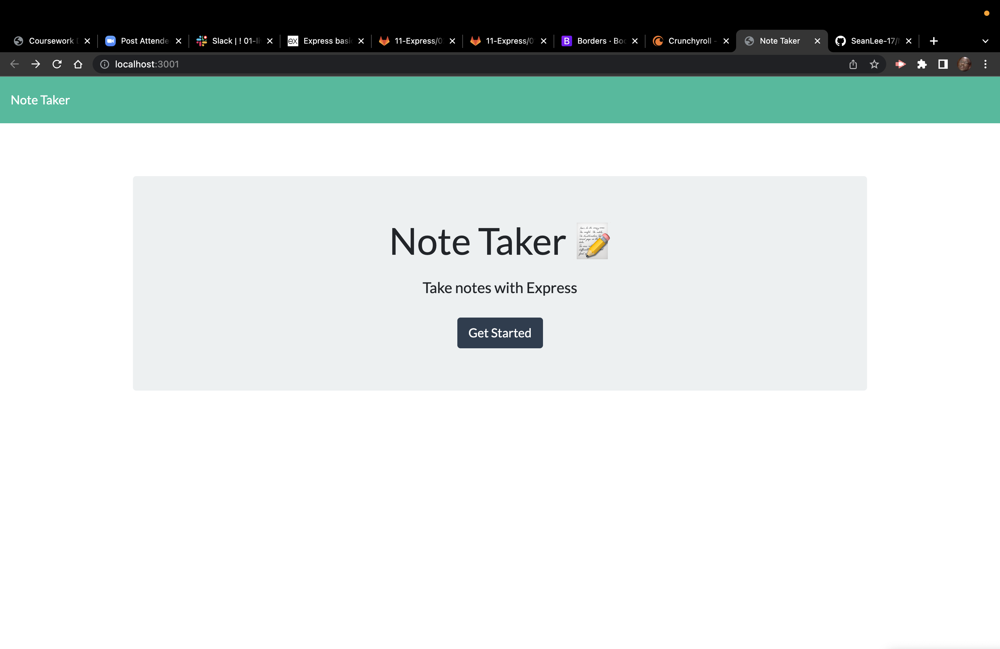

# Nerd's Best Friend

## Description

    This note taker is an effective way to write and save notes onto your desktop. This was accomplished thanks to JavaScript and HTML, while I also utilized Express.js and Uuvid4. This was definitely my most challenging homework assignment for me but after asking teachers and colleagues I was able to figure something out.

## Table of Contents

- [Usage](#usage)

- [Contributing](#contributing)

- [Tests](#tests)

- [Questions](#questions)

- [Links](#links) 

## "I got a blank space baby" -Taylor Swift

    To use this project, type "node server.js" into the terminal to run this program in the localhost.3001. After that you can play around with all the functions including typing, saving, and retrieving notes on the page.

## Contributing

    Me, Professors, and Raj

## Questions

    Github Username: Sean-Lee-17

## Links 
    
- [Github](https://seanlee-17.github.io/Nerds-Best-Friend/)
- [Live Website](https://github.com/SeanLee-17/Nerds-Best-Friend)

## Screenshot

